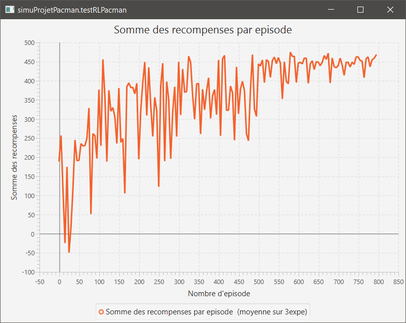

**Nom/Prénom Etudiant 1 : Axel BERTRAND**

**Nom/Prénom Etudiant 2 : Omran HAIDARI**

# Rapport TP1

## Question 5.1 Brigde Grid
*Changez un seul des deux paramètres, soit γ soit le bruit, de sorte à ce que la politique optimale permette à l’agent de traverser le pont*

En changeant la valeur du bruit à 0, l'agent a 100% de chance d'aller dans la direction voulue. Le système devient donc déterministe.

## Question 5.2 Discount Grid
*En partant de valeurs initiales γ =0.9,bruit=0.2, rother =0.0,vous devez obtenir une politique optimale qui suit un chemin sûr pour atteindre l’état absorbant de récompense +10*

1. En changeant la valeur de la récompense à -3, chaque déplacement de l'agent est suffisamment pénalisé pour qu'il cherche à atteindre l'état absorbant le plus proche le plus rapidement possible. La récompense ne doit pas être trop faible pour ne pas rendre les états absorbants négatifs négligeables.
2. En changeant la valeur du bruit à 0, le système devient déterministe et l'agent peut prendre le chemin risqué sans risque.
3. En changeant la valeur de gamma à 0.3, l'agent préférera obtenir la récompense la plus proche en prenant le moins de risque.
4. En changeant la valeur de la récompense à une valeur supérieure à la meilleure récompense, les récompenses des états absorbants sont négligeables et l'agent va charcher à maximiser ses déplacements.


# Rapport TP2

## Question 1:
*Précisez et justifiez les éléments que vous avez utilisés pour la définition d’un état du MDP pour le jeu du Pacman (partie 2.2)*

Nous avons décidé d'utiliser les informations suivantes :
- xPacman et yPacman : la position de l'agent, utile pour savoir où est l'agent
- xGhosts et yGhosts : Les positions des fantômes, utile pour pouvoir estimer la distance entre l'agent et les différents fantômes
- distanceClosestPacdot : La distance avec le pacdot le plus proche du pacman, utile pour savoir si l'agent est proche de manger un pacdot

Ajouter d'autres informations n'améliore pas le taux de victoire de l'agent, voire le réduit.

Grâce à ces informations, l'agent obtient un taux de victoire généralement supérieur à 97%.

Ci-dessous une capture d'écran montrant la somme des récompenses par épisode :



## Question 2:
*Précisez et justifiez les fonctions caractéristiques que vous avez choisies pour la classe FeatureFunctionPacman (partie 2.3).*

Nous avons utilisé les fonctions caractéristiques suivantes pour la classe [FeatureFunctionPacman](src/agent/rlapproxagent/FeatureFunctionPacman.java) :

```java
this.vfeatures[0] = 1;
```

Cette feature sert de biais.

```java
int ghostCount = 0;
int distPacmanGhostX;
int distPacmanGhostY;
for(int i = 0; i < stategamepacman.getNumberOfGhosts(); i++) {
    StateAgentPacman currentGhost = stategamepacman.getGhostState(i);
    distPacmanGhostX = Math.abs(currentGhost.getX() - pacmanstate_next.getX());
    distPacmanGhostY = Math.abs(currentGhost.getY() - pacmanstate_next.getY());
    if ((distPacmanGhostX <= 1 && distPacmanGhostY == 0) || (distPacmanGhostX == 0 && distPacmanGhostY <= 1)) {
        ghostCount++;
    }
}
this.vfeatures[1] = ghostCount;
```

Cette feature sert à savoir si un fantôme peut manger le pacman lors du prochain tour.

```java
boolean pacmannextOnPacdot = stategamepacman.getMaze().isFood(pacmanstate_next.getX(), pacmanstate_next.getY());
this.vfeatures[2] = pacmannextOnPacdot ? 1 : 0;
```

Cette feature sert à savoir si le pacman peut manger un pacdot lors de son prochain déplacement.

```java
double distanceClosestPacdot = stategamepacman.getClosestDot(pacmanstate_next);
this.vfeatures[3] = distanceClosestPacdot / (stategamepacman.getMaze().getSizeX() * stategamepacman.getMaze().getSizeY());
```

Cette feature sert à déterminer la distance qui sépare le pacman du pacdot le plus proche.